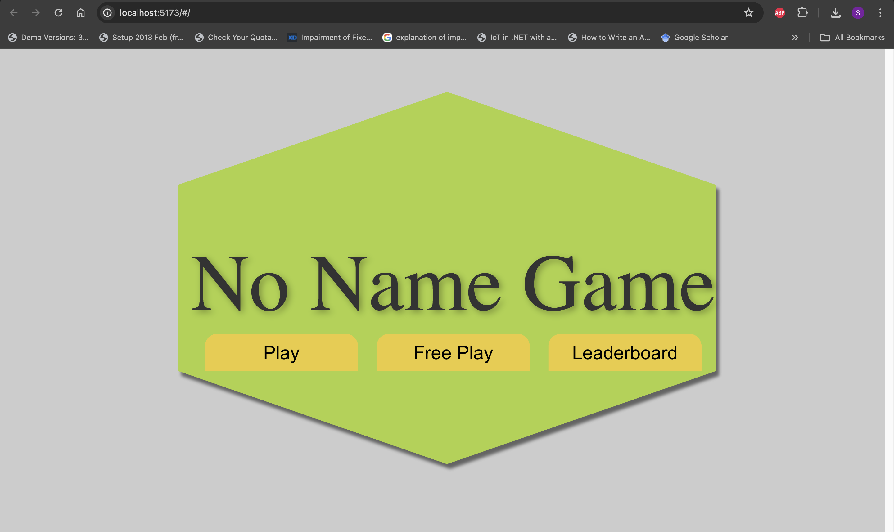
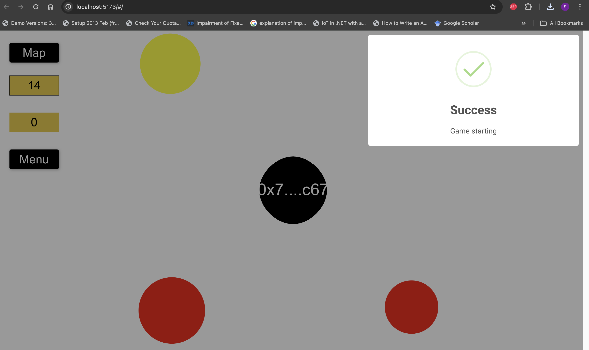
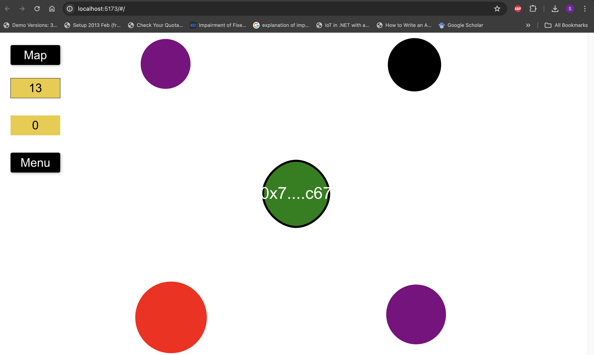
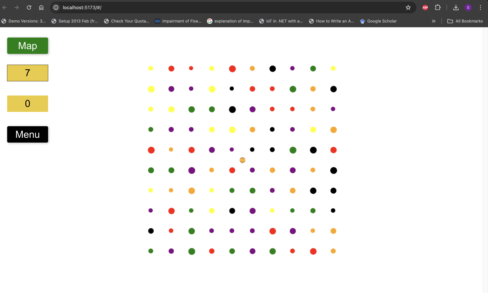
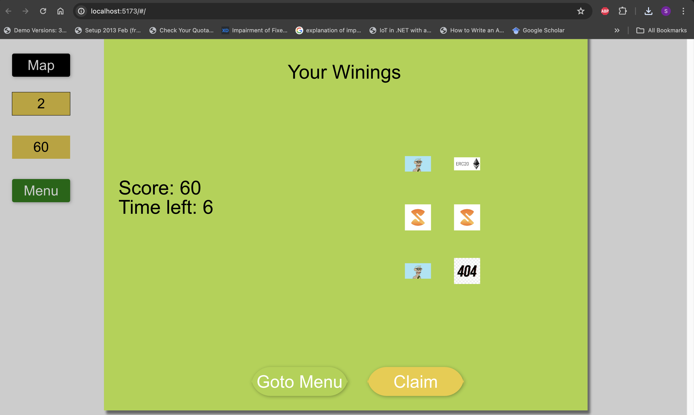
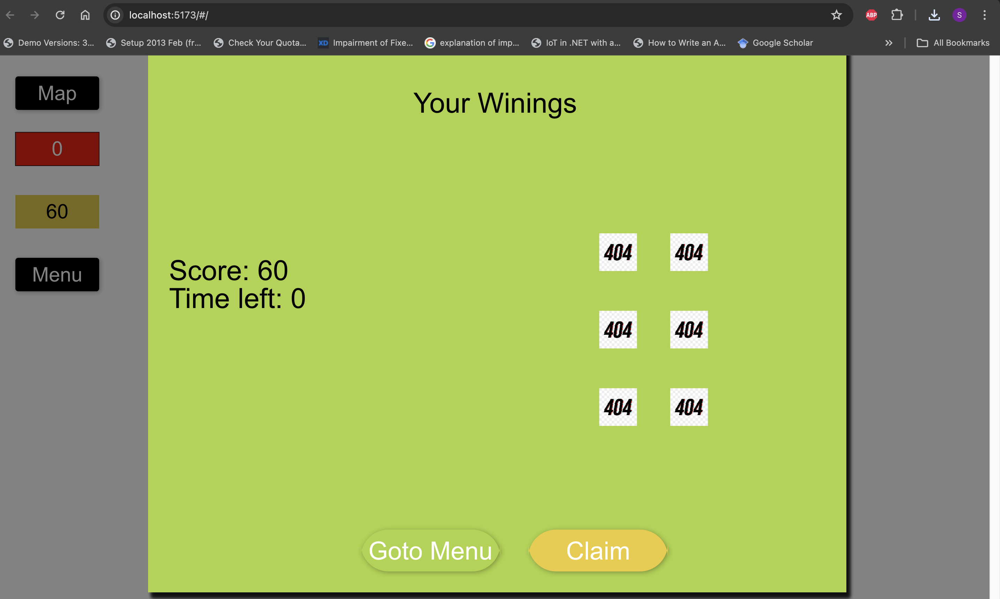
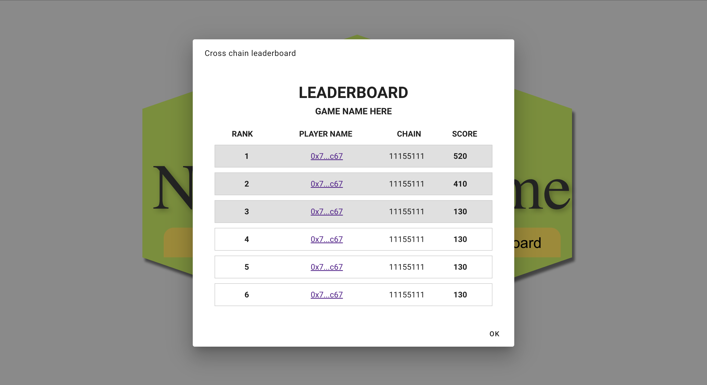

# No Name Game  

This is a Proof of Concept (POC) cross-chain game that can be deployed on any **EVM chain**.

## Badges  
[](https://choosealicense.com/licenses/mit/)  

## Table of Contents  

1. [Overview](#overview)  
2. [Smart Contracts](#smart-contracts)  
    1. [Access Control](#access-control)  
    2. [Game Contract](#game-contract)  
    3. [NFT Contract](#nft-contract)  
    4. [Token Contract](#token-contract)  
    5. [Game Attestation Contract](#game-attestation-contract)  
    6. [VRF Contracts](#vrf-contracts)  
    7. [Stream Creator Contract](#stream-creator-contract)  
    8. [Game Utils](#game-utils)
3. [Rewards](#rewards)  
4. [Screenshots](#screenshots)  
5. [Tech Stack](#tech-stack)  
6. [Features](#features)  
7. [Lessons Learned](#lessons-learned)  
8. [Run Locally](#run-locally)  
9. [Environment Variables](#environment-variables)  
10. [Acknowledgements](#acknowledgements)  
11. [Feedback](#feedback)  
12. [Future Plans](#future-plans)  
13. [License](#license)  

## Overview

Players can enjoy the game on any blockchain where it is deployed. The cross-play feature allows a player on Chain A, who doesn't have enough tokens, to request a play token from Chain B, provided they have previously bought or received a free play token that hasn't expired. This cross-chain communication is facilitated through CCIP (Cross-Chain Interoperability Protocol), and each token is issued using the Sign protocol. Prizes are awarded randomly to users, utilizing Chainlink VRF (Verifiable Random Function) to ensure fairness. The game interacts with various smart contracts illustrated by the diagram below.


## Smart Contracts

### Access Control
This contract is responsible for granting admin access to any contract that the Game Contract interacts with. This is necessary to ensure that only authorized entities are allowed to mint or control any admin functions defined in any smart contract. The caveat to this approach is that it centralizes control, which is acceptable in this instance since it's just a Proof of Concept (POC).

### Game Contract
This contract routes any interactions with external contracts such as:
- Game Attestation Contract
- Chainlink CCIP
- NFT Contract
- Token Contract
- Stream Creator

The game contract is the heart of the entire system. Players have three ways to play the game:
- **Free Play**: Redeem a free play token valid for three days.
- **Paid Play**: Purchase a play token valid for seven days. Each play token costs a defined number of units of the PlayToken.
- **Cross Play**: Use a token from another chain to play, provided a token was purchased or claimed on that chain. The cross chain communication is facilliated by chainlinks CCIP infrustructure where a player on chain A sends a <b>message</b> to chain b the exact implementation can be found here: <br/>
- **Send message Chain A**: https://github.com/Brianspha/chainlink_game/blob/main/packages/contracts/src/game/Game.sol#L249
- **Recieve Message from Chain A**: https://github.com/Brianspha/chainlink_game/blob/main/packages/contracts/src/game/Game.sol#L364

This works vice versa aswell 
### NFT Contract
The NFT contract is used to reward users who have collected in-game items.

### Token Contract
The Token contract is used to reward users who have collected in-game items and to define the PlayToken used to play the game.

### Game Attestation Contract
This contract issues Play Tokens with a validity timeframe. The Sign Protocol, an omni-chain attestation protocol, enables users to freely attest and verify any information on-chain, ensuring the authenticity of PlayTokens.

### VRF Contracts
These contracts facilitate the requesting of random numbers. They are modified to work locally for better testing without needing to fork existing implementations.

### Stream Creator Contract
This contract distributes rewards to users who have won by playing the game. It interacts with the Sablier Protocol, a token distribution protocol designed for by-the-second payments for cryptocurrencies, specifically ERC-20 assets.

### Game Utils
This contract consists of data types, events, and other types used by the Game contract and for testing.

## Rewards

With each play session, a player is given a specified time (e.g., three minutes) to move around the map collecting items that match their color. Collecting non-matching items decreases their size and remaining time, while matching items reward extra time and possibly one of the following:
- NFT
- Token
- Sablier Stream

Prizes are selected randomly based on the total number of items collected. The `getWinnings` function requests random indexes from a globally defined prize pool set by the admin. Players must pass a signature signed by the game client when calling the `getWinnings` function or submitting their scores to ensure fairness.

### Blacklisting or Whitelisting
Players can be blacklisted or whitelisted by the admin based on defined criteria.

## Screenshots  

1. 
2. 
3. 
4. 
5. 
6. 
7. 
8. 

## Tech Stack  

 
 
  
     
 
  
 
 

## Features  

- Play on Chain A or Chain B
- Leaderboard
- Free Play

## Lessons Learned  

Building this project has been an enlightening experience. Some of the key takeaways include:
- Understanding the complexities of cross-chain communication.
- Learning how to implement Chainlink VRF for randomness in smart contracts.
- Realizing the importance of robust access control and security measures.

## Run Locally  

Clone the project:

```bash  
git clone https://link-to-project
```

Go to the project directory:

```bash  
cd my-project
```

Install dependencies:

```bash  
npm install
```

Start the server:

```bash  
npm run start
```

## Environment Variables  

To run this project, you will need to add the following environment variables to your `.env` file:

- `API_KEY`
- `ANOTHER_API_KEY` 

## Acknowledgements  

- [Awesome Readme Templates](https://awesomeopensource.com/project/elangosundar/awesome-README-templates)
- [Awesome README](https://github.com/matiassingers/awesome-readme)
- [How to Write a Good README](https://bulldogjob.com/news/449-how-to-write-a-good-readme-for-your-github-project)

## Feedback  

If you have any feedback, please create an issue and tag me.

## Future Plans

While I currently don't have enough time to work on this project, here are some future plans if time allows:
- Fully test cross-chain play.
- Record each user play session and add it to the leaderboard for others to watch.
- Build a cross-chain NFT marketplace for users to trade their rewards.

